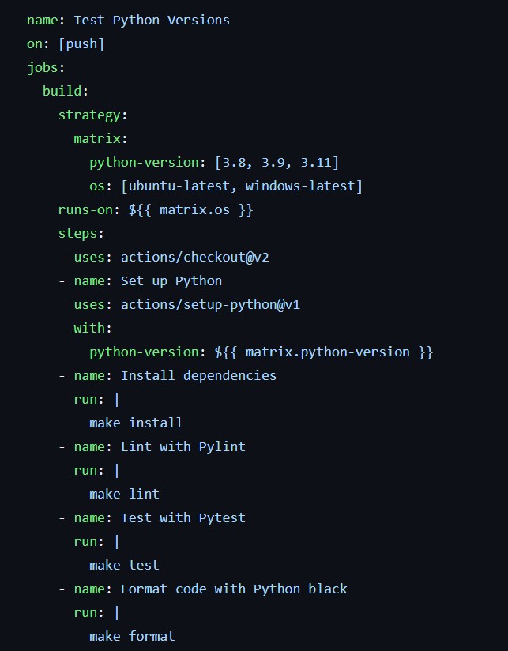

# Week 4
The purpose of this project is to test code in multiple different Python versions and operating systems in Github Actions. The YAML configuration was altered to allow multiple jobs to be run. The tests are run using the same `first.py` script used in the python template from week 1. Below are the changes made to main.yml to incorporate ubuntu and windows operating systems, as well as Python versions 3.8, 3.9, and 3.11. 

## Instructions
Use Github codespaces, which will allow for a container to be built with the required packages, as detailed in requirements.txt. In the terminal, use `make install` to install the necessary packages from `requirements.txt`. Use `make format` to format the code using python black and `make lint` to lint the code. Finally, use `make test` to run the test cases from `test_first.py` . One can also directly run the two python scripts in this repo using `python first.py` and `python test_first.py`. 

One can push any code changes and observe testing of the different Python versions and operating systems by the Github Actions configuration. 

## Github Actions with Matrix Strategy
https://github.com/nogibjj/drktao-week4mp-matrix/actions/runs/6288143547
